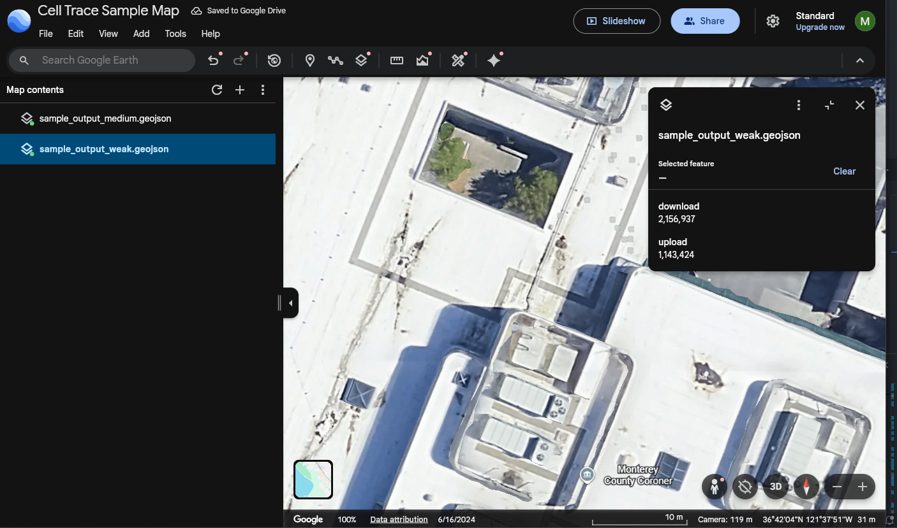

# 📶🛰️ Cell Trace

Cell Trace is intended for public safety system administrators to monitor and store cellular network throughput metrics and pin measurements to geographic locations. For instance, at the Monterey County Sheriff's Office, we wanted to measure the cellular connectivity along Highway 1, Big Sur, and remote areas near the Ventana Wilderness. 

To utilize Cell Trace, your device will need a GPS chip, which are embedded in most Panasonic Toughbooks. Natively, data is captured in CSV format, which can be exported to GeoJSON using the `-x "filename"` parameter. GeoJSON is well recognized format among geography-focused applications (i.e., Google Earth, GIS, etc.), whereas CSV is not. 


## How to use 

### 1️⃣ Capture network and GPS metrics 

To run this program with default parameters, issue the following command. This will run network and GPS evaluations until a keyboard interrupt is issued.

```python
python -m src.main
```

Here are the options defined within the help menu. 

```powershell
python -m src.main -h                  
    usage: python.exe -m src.main [-h] [-c COM] [-l {none,debug,info,warning,error}] [-t TIMEOUT] [-x EXPORT]

    options:
    -h, --help            show this help message and exit
    -c, --com COM         Set the COM serial port to read GPS data from.
    -l, --log {none,debug,info,warning,error}
                            Set the logging level of the application. Default is "INFO" level logging.
    -t, --timeout TIMEOUT
                            The interval between network and GPS data sampling.
    -x, --export EXPORT   Trigger export capabilities, must provide file path to csv data.
```


### 2️⃣ Stop capturing network and GPS metrics 

By design the program runs continuously until you kill the running process. You can easily stop it using one of two methods: First, you could issue `ctrl + c` in the shell window - this will kill the running Cell Trace process. Alternatively, you could close the shell window - this will kill any child processes invoked by the shell window process.


### 3️⃣ Export CSV data to GeoJSON

By default, data is collected in CSV format. To export it to GeoJSON (a popular file format many applications), issue the `-x "input filename"` flag. An example is provided below.

```python
python -m src.main -x "./output/sample_output.csv"
```


## 📥 Importing data to Google Earth

After exporting the data to GeoJSON format, you can import the data to Google Earth or GIS applications. This export will split "weak" download metrics from "medium" and "strong" metrics. This allows you to have different "layers" in the application of your choosing. You can filter "strong" and "medium" metrics to identify areas of weaker connectivity.



## ⛓️ Python package dependencies

To run this program, install the following Python packages.

```python
python -m pip install pynmea2 pyserial speedtest-cli
```


## Contributors

Programmer: Cameron Oakley (Oakley.CameronJ@gmail.com)

Organization: Monterey County Sheriff's Office